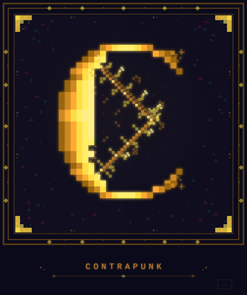

<p align="center">
  
</p>

<h1 align="center">Contrapunk</h1>

Real-time MIDI harmony generator and guitar-to-MIDI converter with classical voice leading rules, built in Rust.

Play a note on your MIDI controller or plug in your guitar and Contrapunk generates melodically independent harmony lines that follow actual counterpoint rules: Palestrina, Bach Chorale, Jazz, or Free style. Not just "a third above", but proper voice leading that avoids parallel fifths, prefers stepwise motion, and maintains voice independence. In real-time. With sub-10ms latency.

Runs as a native desktop app (Tauri), in the browser via WebAssembly, or as a server for network MIDI processing.

## Try It

Browser version: [contrapunk.fly.dev](https://contrapunk.fly.dev/)

## Features

### Harmony Engine
- **8 harmony modes**: Pass Through, Diatonic Thirds, Diatonic Fourths, Random Below, Random (No Seconds), Contrary Motion, Strict Counterpoint, Barry Harris
- **28 scale modes** across 5 families: Diatonic Modes, Harmonic Minor, Melodic Minor, Exotic, Barry Harris 6th Diminished
- **4 voice leading styles**: Palestrina (Renaissance), Bach Chorale (Baroque), Jazz (Modern), Free
- **Modal interchange**: out-of-scale notes harmonized by borrowing from parallel modes (5 configurable range levels)
- **Deterministic voicing**: 6-tier tiebreaking ensures identical output for identical context, verified by 100x determinism tests
- **Chord detection**: extended chords, slash chords, add chords with roman numeral analysis (40+ patterns)

### Voice Leading Rules (from Palestrina's practice)
- Parallel fifths/octaves detection and rejection
- Voice crossing prevention
- Spacing rules (max 12 semitones between adjacent voices)
- Motion independence scoring
- Configurable per style: Palestrina hard-rejects parallels, Jazz allows them

### Humanization
- Timing jitter (1-30ms), velocity variation, duration adjustment
- Swing/groove with tempo-aware beat clock
- 11+ musical style presets with character personas

### Guitar Input (Audio-to-MIDI)
- Plug in any guitar via audio interface and get real-time MIDI output
- **Pitch detection**: McLeod, BACF, AMDF, Goertzel filter bank, Single-Cycle detector
- **Onset detection**: HFC + spectral flux + RMS spike with configurable sensitivity
- **Low-latency pipeline**: 2-frame pitch voting, 128-sample cpal buffer (~2.7ms), single-cycle early confirmation
- **Auto-calibration**: tune your guitar and Contrapunk learns your instrument's response
- **Signal feedback**: real-time DSP visualization with noise gate controls
- **String + fret identification** with per-guitar calibration profiles
- **Tauri native support**: guitar signal events streamed at 30fps, note display throttled to prevent UI jitter
- **WASM support**: full Rust DSP pipeline runs in the browser via WebAssembly (no JS pitch detection)
- 280+ tests including full audio pipeline integration tests

### ML Classifier (In Development)
- 139-class guitar string+fret classifier
- Hybrid approach: Goertzel harmonic features + CNN on attack spectrograms
- Pure Rust inference (no ONNX dependency, works in WASM)
- Per-guitar calibration profiles
- Visual learning app (SvelteKit) for exploring every step of the ML pipeline

### Platform Support
- **Native desktop**: macOS, Linux, Windows via Tauri v2
- **Browser**: WebAssembly via wasm-pack, deployed on Fly.io
- **Server mode**: TCP network processing for ensemble/studio setups
- **Same Rust core** everywhere, no ports, no rewrites

## Quick Start

### Native (Tauri desktop app)
```bash
git clone https://github.com/contrapunk-audio/contrapunk.git
cd contrapunk
cargo tauri dev
```

### Browser (WASM)
```bash
cd ui
npm install
npm run build:wasm
npm run dev
```

### Guitar Tools
```bash
# Tuner (with auto-calibration)
cargo run --release --example guitar_tuner

# Guitar-to-MIDI harmony
cargo run --release --example guitar_harmony

# Training data capture for ML classifier
cargo run --release --example guitar_capture
```

## Architecture

```
src/
  harmony/              Harmony engine, scales, modes, chord detection
    engine.rs           Main processing pipeline
    scale.rs            28 scale modes + modal interchange
    modes.rs            8 harmony algorithms
    config.rs           Key, Mode, Scale enums
    stateful.rs         Contrary motion + counterpoint state
    voice_leading/      Palestrina/Bach/Jazz/Free voice leading
      voicer.rs         Deterministic voicing with cartesian product scoring
      rules.rs          Parallel fifths, crossing, spacing checks
      styles.rs         Style-specific scoring weights
  audio/                Audio capture and pitch detection
    guitar_input.rs     Full guitar DSP pipeline (onset, pitch, note state machine)
    pitch.rs            Note tracking with onset gating + octave correction
    onset.rs            Pluck detection (HFC + spectral flux)
    detectors.rs        BACF, AMDF, Goertzel filter bank
    single_cycle.rs     Ultra-low-latency single-cycle detection
    buffer.rs           Dual-buffer analysis, overlap manager
    guitar.rs           Guitar calibration, string matching, onset grouping
    test_signals.rs     Reference signal generators for testing
  humanize/             Timing jitter, velocity, swing, beat clock
  midi/                 MIDI I/O (midir native, Web MIDI API for WASM)
  server/               TCP server/client for network MIDI
  preset/               Musical style presets with personas

src-tauri/              Tauri v2 desktop wrapper
  guitar_bridge.rs      cpal audio capture with signal channel
  commands/engine.rs    Tauri IPC commands, guitar-signal event streaming

wasm/                   WASM bridge (wasm-bindgen)
ui/                     SvelteKit frontend (Svelte 5, Tailwind)
ml/                     ML classifier pipeline
  CONCEPTS.md           Educational reference for all ML/audio concepts
  loader.py             Python dataset loader
  app/                  SvelteKit visual learning app

examples/
  guitar_tuner.rs       Live tuner with auto-calibration
  guitar_harmony.rs     Guitar audio to harmony engine to MIDI out
  guitar_capture.rs     ML training data capture tool
  guitar_calibrate.rs   Guitar calibration (auto from tuning)
  guitar_demo.rs        Offline guitar module demo
```

## Testing

```bash
# All tests (280+)
cargo test

# Audio pipeline only
cargo test --test audio_pipeline -- --nocapture

# Guitar module
cargo test -p contrapunk guitar

# Specific detector
cargo test -p contrapunk detectors
```

## Deployment

Deployed to Fly.io at [contrapunk.fly.dev](https://contrapunk.fly.dev/).

## Documentation

- [Engine Deep Dive](docs/ENGINE_DEEP_DIVE.md): Complete technical documentation with ASCII art diagrams
- [Project Journey](docs/PROJECT_JOURNEY.md): The story of building Contrapunk
- [ML Concepts](ml/CONCEPTS.md): Educational guide to every ML and audio concept used
- [Architecture Map](.planning/codebase/ARCHITECTURE.md): Full codebase architecture

## Open Source

MIT licensed. Counterpoint rules are centuries of accumulated human knowledge about what sounds good and why. They should be accessible to every musician.

## Credits

Built with Rust, SvelteKit, Tauri, and a deep love for music.
