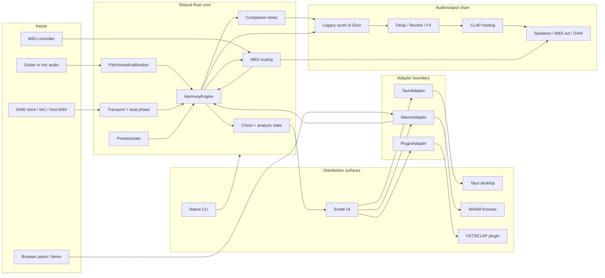
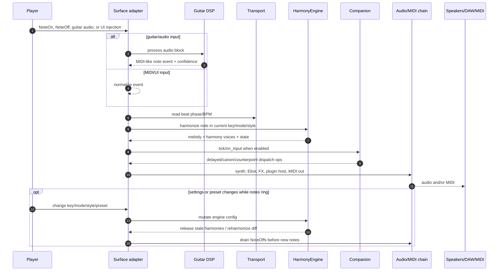
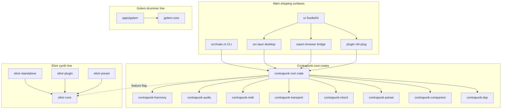
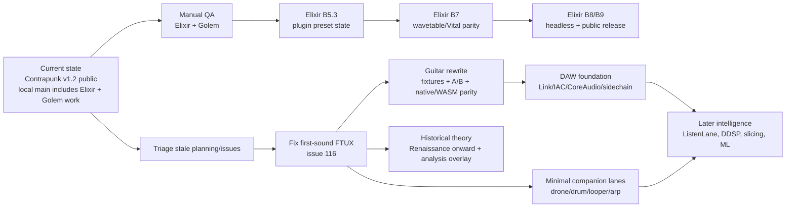
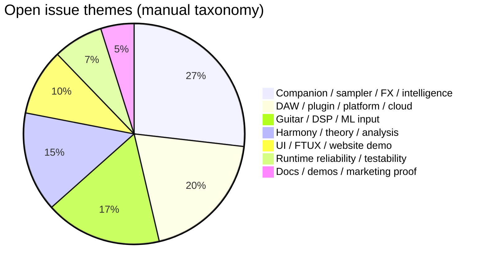
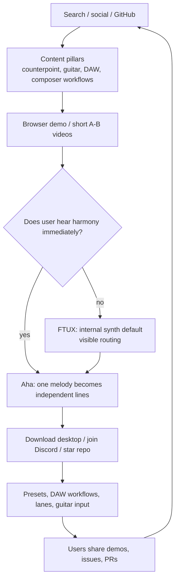

# Contrapunk Current State, Engineering Roadmap, and Organic Growth Plan

Generated: 2026-06-29  
Repo: [`github.com/contrapunk-audio/contrapunk`](https://github.com/contrapunk-audio/contrapunk)

## How to read this

This is a snapshot, not a promise. It combines:

- local repo + `graphify-out/GRAPH_REPORT.md`
- GitHub issue snapshot: 63 issues, 41 open, 22 closed
- planning docs in `.planning/` read-only
- subagent recon in `recon/`
- current local git history, which is ahead of the public `v1.2.0` release

Important caveat: some `.planning/` status tables are stale. The freshest evidence is the later `.planning/STATE.md` appendices plus current git log.

---

## Executive summary

Contrapunk is currently three related products living in one Rust workspace:

1. **Contrapunk** — the main real-time counterpoint instrument.
   - Desktop Tauri app, browser/WASM app, CLI, and VST3/CLAP plugin surface.
   - Core differentiator: one live note/melody becomes independent counterpoint, not just parallel interval transposition.

2. **Elixir** — the in-progress synth engine/product line.
   - `elixir-core`, `elixir-standalone`, `elixir-plugin`, `elixir-preset` are already in the workspace.
   - Current state: A6/A-Cut/B3/B4/B5.2 are implemented locally; next useful work is QA + plugin preset serialization + wavetable parity.

3. **Golem** — a new adaptive drummer prototype.
   - `crates/golem-core` + `apps/golem` exist.
   - Treat as a prototype until it passes basic timing/audio/follow validation.

The highest-leverage engineering move is **not another big feature**. It is:

1. make first launch reliably audible (`#116`),
2. manually QA Elixir/Golem prototypes,
3. close/re-scope stale issues,
4. then resume small, validated roadmap slices.

The highest-leverage marketing move is to own the phrase:

> Real-time counterpoint you can hear immediately.

Everything should ladder back to audible A/B demos: fixed harmonizer vs actual independent voice-leading.

---

## Graphify snapshot

Graphify analysis exists at `graphify-out/`:

- **295 files**
- **4,607 nodes**
- **10,631 edges**
- core hubs include `WasmAdapter`, `PluginAdapter`, `TauriAdapter`, `Engine`, `HarmonyEngine`, `GuitarInput`, and `ElixirApp`
- key hyperedge: four-surface distribution from one Rust core: CLI, Tauri, WASM, plugin

Note: `graphify update .` attempted during this recon but crashed with `expected string or bytes-like object, got 'NoneType'` after extraction warnings. The existing graph/report still loaded and was used.

---

## What exists today

### Product surfaces

| Surface | Path | Current role |
|---|---|---|
| Native CLI | `src/main.rs` | headless/server/client/dev path |
| Desktop app | `src-tauri/` + `ui/` | main musician-facing app |
| Browser app | `wasm/` + `ui/` | `app.contrapunk.com`, Web MIDI/WASM engine |
| Plugin | `plugin/` | nih-plug VST3/CLAP MIDI harmony plugin with webview UI |
| Elixir standalone | `crates/elixir-standalone/` | synth product prototype/UI |
| Elixir plugin | `crates/elixir-plugin/` | synth plugin skeleton + automation surface |
| Golem app | `apps/golem/` | adaptive drummer prototype |

### Core Contrapunk features

- MIDI input/output and routing.
- Browser Web MIDI path.
- Guitar/audio input pipeline with onset/pitch detection and calibration concepts.
- Harmony engine with:
  - pass-through
  - diatonic thirds
  - diatonic fourths
  - random below
  - random below without seconds
  - contrary motion
  - strict counterpoint
  - Barry Harris
  - functional harmony
  - Bach chorale mode
- 57 scale modes across 10 families in current code.
- Modal interchange and borrowed-note UI concepts.
- Counterpoint species 1-4.
- Voice-leading styles: Palestrina, Bach Chorale, Jazz, Free.
- Voice position and voice count control.
- Octave modes: none, spread, bass/treble split, mirror.
- Humanization, transport, metronome, delay/reverb/synth controls.
- Companion system with Lane abstraction and shipped Canon/Counterpoint lanes.
- HoldMode semantics for pending companion emissions.
- Svelte adapter layer: `TauriAdapter`, `WasmAdapter`, `PluginAdapter`.
- UI components for piano, fretboard, history, transport, companion, chain/plugins, presets, guitar input, etc.
- CLAP plugin hosting work in `src/plugin_host/clap/` and chain/audio block abstractions.
- Preset infrastructure.
- Release history: latest public GitHub release is `v1.2.0 — Palestrina Proteus`.

### Elixir features committed locally

- `elixir-core` voice engine with 16-voice polyphony, sustain, voice stealing.
- Oscillator controls: spectral morphs, phase distortion, unison styles.
- Filters: Digital SVF, Diode, Dirty, Formant, Phaser.
- FX chain: Drive, Delay, Reverb, FDN Reverb, Chorus, Flanger, Phaser, Compressor.
- Feature-gated Tauri synth replacement: `--features elixir-synth`.
- `elixir-plugin` with CLAP/VST3 skeleton and DAW automation surface.
- `elixir-preset` schema + `.vital` / `.vitalbank` import subset.
- `elixir-standalone` UI with A6 controls and Vital import.

### Golem features committed locally

- `golem-core`: procedural audio-native drummer engine.
- Clock-driven scheduling, procedural kick/snare/hat/tom/crash voices.
- `AdaptiveDynamics`: turns guitar RMS/onsets/density into drummer intent.
- `apps/golem`: Tauri/Svelte app with controls, meters, audio input selection, 2D drummer pad.

---

## Architecture diagrams

### System architecture



### Runtime event flow



### Crate and surface map



### Roadmap shape



### Issue taxonomy



### Organic growth funnel



---

## GitHub issues state

Issue snapshot:

| State | Count |
|---|---:|
| Open issues | 41 |
| Closed issues | 22 |
| Total issues | 63 |

Manual taxonomy:

| Bucket | Open | Closed | Notes |
|---|---:|---:|---|
| Harmony engine, theory, analysis | 6 | 6 | auto-key, historical theory, analysis overlays |
| UI, FTUX, website/demo | 4 | 14 | first-sound pain, autoplay, presets/embed leftovers |
| Guitar/audio-to-MIDI, DSP/ML | 7 | 0 | rewrite, fixtures, polyphonic detection |
| Companion lanes, sampler, FX, intelligence | 11 | 1 | biggest active expansion direction |
| DAW/plugin/platform/cloud | 8 | 0 | plugin, openDAW, Link, IAC, Windows, cloud |
| Docs/demos/marketing proof | 2 | 0 | samples and walkthrough still open |
| Runtime reliability/testability | 3 | 1 | stale harmonies, router testability, MIDI-out reports |

Open issues likely stale/superseded:

- `#4` auto-key — appears implemented but needs user verification.
- `#14` MIDI out bug — latest local build reportedly worked.
- `#30` Windows — CI artifacts exist; needs tester handoff.
- `#42` autoplay — useful only if tied to first-sound onboarding.
- `#79` guitar pitch/debug — superseded by `#82` rewrite.
- `#106` May 14 jam item — deadline passed; close or rewrite.

Open issues that should stay and be decomposed:

- `#116` first-run silence: promote to near-term P0/P1.
- `#117` / `#121` companion lane mega-scope: split into small lane/runtime slices.
- `#82` guitar rewrite: keep as umbrella, add fixtures/parity gates.
- `#98` / `#99` / `#119` / `#120` DAW sync/capture/sidechain foundation.
- `#102` / `#104` / `#118` ML/audio intelligence: review dependency/license/WASM risk before building.
- `#115` / `#112` theory roadmap: keep test-first.

---

## Engineering roadmap

### Now: reduce uncertainty

1. **Fix first-sound FTUX (`#116`).**
   - Fresh install should make sound without opening Voice Routing.
   - Show voice output target inline.
   - This is small and unlocks marketing demos.

2. **Manual QA for Elixir.**
   - `elixir-standalone`: audio/MIDI, A6 controls, FX, Vital import.
   - Tauri with `--features elixir-synth`: verify the app actually uses Elixir and old synth controls still affect sound.

3. **Manual QA for Golem.**
   - Check tempo stability, output audio, guitar meters, follow response, no callback weirdness.
   - Do not expand Golem until this passes.

4. **Reconcile state.**
   - Close/re-scope stale issues.
   - Update labels/milestones.
   - Treat `.planning/ROADMAP.md` phase counters as stale where they conflict with git/STATE appendices.

### Next: finish committed product lines

1. **Elixir B5.3:** plugin preset state serialization/loading.
2. **Elixir B7:** wavetable editor + real Vital `.vitaltable`/spectral parity.
3. **Guitar rewrite quality gate:** fixtures, native/WASM lockstep, A/B per stage, latency docs.
4. **Minimal companion lanes:** ship one or two tiny lanes before `#121` scale.
5. **DAW foundation:** tempo sync/capture primitives before smart sidechain/listen layers.
6. **Marketing proof assets:** audio samples and walkthroughs (`#5`, `#13`).

### Later: bigger bets

- ListenLane, Demucs/Basic Pitch, TimbreIntelligence, DDSP.
- SampleLane, smart slicing, audio intelligence.
- Full Golem sampler/kit format and later Contrapunk `GolemBlock` integration.
- openDAW, Cloud, deeper plugin formats/hosting.
- Historical theory roadmap: Renaissance → Baroque → Classical → Romantic → modern.

### Validation commands

Baseline:

```bash
cargo check --workspace --message-format=short
cargo test -p contrapunk-harmony --lib
npm --prefix ui run check
```

Elixir:

```bash
cargo test -p elixir-core --lib
cargo check -p elixir-core --target wasm32-unknown-unknown
cargo check -p elixir-standalone
cargo check -p elixir-plugin
cargo check -p contrapunk --features elixir-synth
cargo check -p contrapunk-tauri --features elixir-synth
cargo test -p contrapunk --features elixir-synth chain::elixir_block --lib
```

Golem:

```bash
cargo check -p golem-core
cargo check -p golem-tauri
npm --prefix apps/golem run check
```

---

## Marketing roadmap

### Positioning

Use this repeatedly:

> Contrapunk is a free, open-source real-time counterpoint instrument: plug in MIDI or guitar, choose a style, and hear independent harmony voices instead of parallel pitch-shifted copies.

Contrast:

- not just a harmonizer pedal,
- not just a chord generator,
- not just an academic demo,
- not a generic AI composer.

### Content pillars

| Pillar | Audience | Core topics | CTA |
|---|---|---|---|
| Counterpoint you can hear | theory learners, composers | species counterpoint, parallel fifths, contrary motion, Palestrina/Bach | browser demo preset |
| Guitar into harmony | guitarists, live loopers | guitar counterpoint, guitar harmonizer alternative, guitar-to-MIDI harmony | browser demo / native app |
| DAW/plugin workflows | producers, Logic/Ableton/Reaper users | IAC, loopMIDI, MIDI routing, plugin hosting, no-sound checklist | setup checklist |
| Composer workflows | writers, scoring, jazz learners | harmonize one melody, modal interchange, Barry Harris, style comparisons | MIDI/preset pack |
| Comparison/category pages | problem-aware searchers | harmonizer vs counterpoint, Scaler alternative, chord tool vs melody tool | honest comparison + demo |
| OSS audio engineering | Rust/audio/plugin devs | Rust WASM MIDI, CLAP hosting, realtime rules engine | GitHub/repo CTA |

### Keyword priorities

| Priority | Cluster | Page type |
|---|---|---|
| P0 | counterpoint generator / real-time counterpoint / voice leading rules | evergreen pillar + glossary |
| P0 | guitar harmonizer alternative / guitar counterpoint exercises | demo lesson + A/B audio |
| P0 | MIDI harmony plugin / Ableton/Logic routing / IAC Driver | setup tutorials |
| P1 | harmonize a melody / melody harmonizer / accompaniment generator | workflow posts |
| P1 | Scaler alternative / chord generator alternative | honest comparison hub |
| P1 | Barry Harris / modal interchange / Bach chorale harmonizer | deep-dive demos |
| P2 | Rust audio / WASM MIDI / CLAP host Rust | dev logs |

### Eight-week publishing plan

Cadence: one useful long-form page + two short demo clips + one community post per week.

| Week | Main publish | Demo clips | Lead magnet |
|---|---|---|---|
| 1 | What is a counterpoint generator? | fixed thirds vs Contrapunk; no parallel fifths | browser preset |
| 2 | First species counterpoint: rules you can hear | consonance demo; bad parallels rejected | PDF cheat sheet + MIDI cantus |
| 3 | Counterpoint exercises for guitarists | dry guitar → counterpoint; contrary-motion riff | guitar workout PDF/TAB |
| 4 | Route Contrapunk into Logic/Ableton/GarageBand | IAC setup; no-sound checklist | DAW routing checklist |
| 5 | Guitar harmonizer pedal vs counterpoint generator | pedal third vs independent voice | A/B audio gallery |
| 6 | Harmonize one melody 5 ways | Palestrina/Bach/Jazz/Free/BH | MIDI + preset pack |
| 7 | MIDI harmony plugin workflow | Contrapunk into synth; CLAP instrument path | melody prompts pack |
| 8 | How Contrapunk works under the hood | code-to-sound; browser vs native | dev signup/GitHub CTA |

### Metrics

Acquisition:

- non-brand Google clicks for P0 clusters,
- video retention through first 10 seconds,
- referral sessions from guitar/theory/DAW communities,
- GitHub stars/backlinks from dev content.

Activation:

- article → app click-through,
- app opened → input selected → output selected → first harmony generated,
- no-sound support questions per 100 new users,
- DMG downloads from tutorial pages.

Retention/trust:

- PDF/MIDI downloads,
- Discord/email/GitHub conversion,
- repeat visits to routing/tutorial pages,
- comments/questions that become FAQs.

### What to skip

- Generic “AI music generator” SEO.
- Lots of thin competitor pages.
- Daily low-quality social posting.
- A full music theory course.
- Heavy influencer/webinar programs before demo pages convert.
- Claims about unshipped surfaces: cloud, full AU/VST3 distribution, Golem, future Elixir parity.
- Gating the browser demo behind email.

---

## Source artifacts

Subagent/recon outputs used:

- `recon/planning-roadmap.md`
- `recon/github-issues.md`
- `recon/engineering-roadmap-synthesis.md`
- `recon/marketing-content-pillars.md`
- `recon/diagram-snippets.md`

Primary project docs/code used:

- `README.md`
- `Cargo.toml`
- `.planning/PROJECT.md`
- `.planning/STATE.md`
- `.planning/ROADMAP.md`
- `docs/MARKET_ANALYSIS.md`
- `docs/PROJECT_JOURNEY.md`
- `ELIXIR-PLAN.md`
- `ELIXIR-DESIGN.md`
- `GOLEM-DESIGN.md`
- `GOLEM-RESEARCH.md`
- `graphify-out/GRAPH_REPORT.md`

GitHub issue source:

- `gh issue list -R contrapunk-audio/contrapunk --state all --limit 200`
- issue details for key roadmap issues `#4`, `#8`, `#9`, `#14`, `#27`, `#28`, `#29`, `#30`, `#42`, `#65`, `#66`, `#81`, `#82`, `#98`, `#99`, `#102`, `#104`, `#106`, `#112`, `#115`, `#116`, `#117`, `#118`, `#119`, `#120`, `#121`
