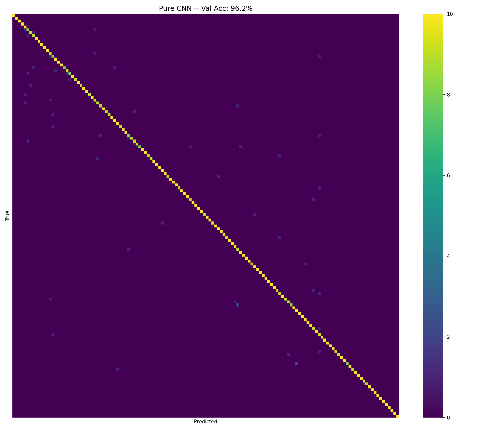
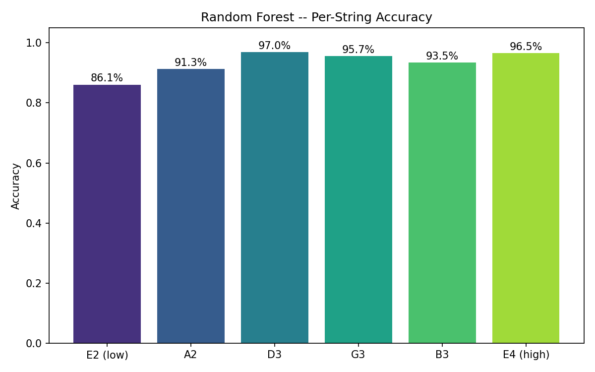
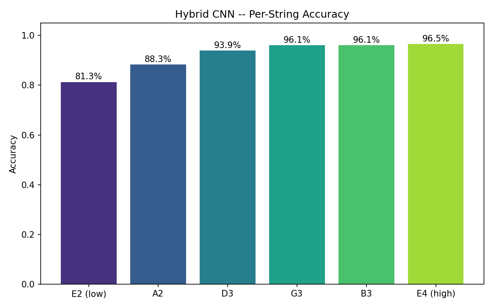
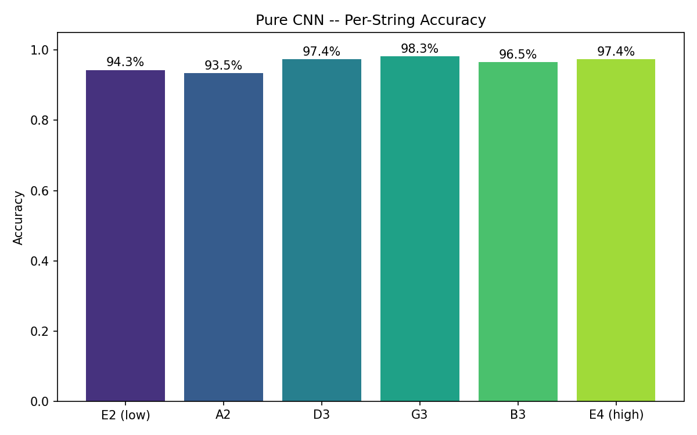
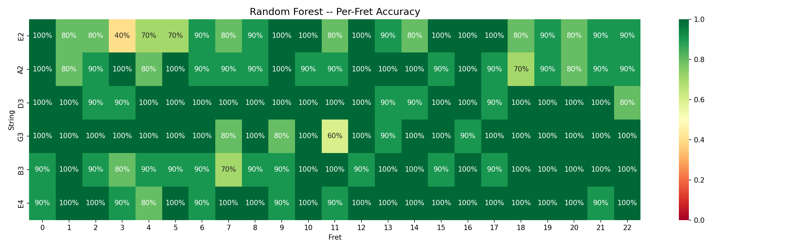
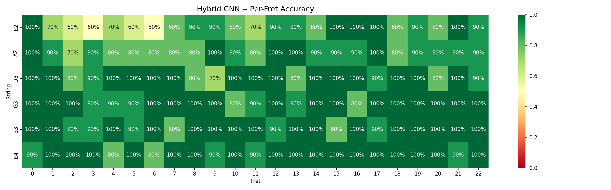
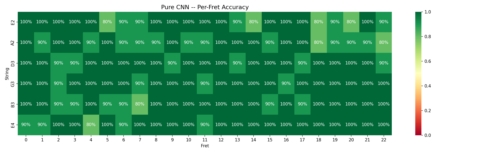
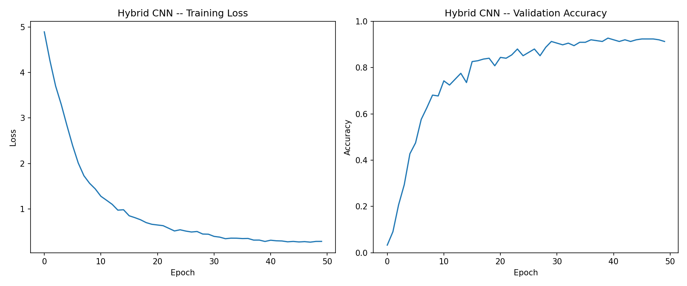
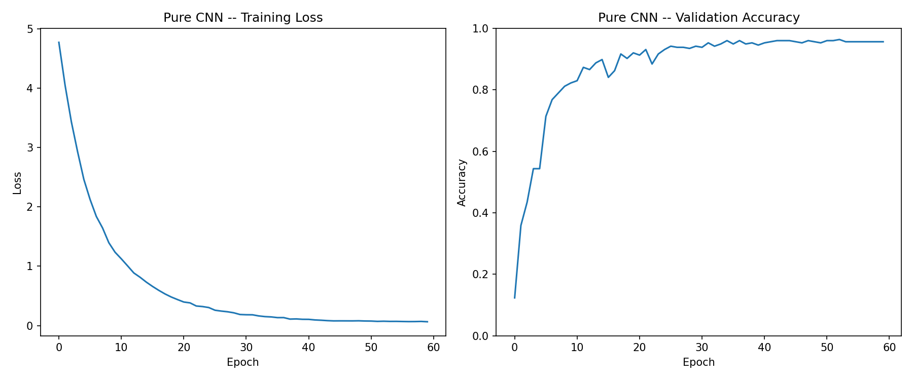

# Round 1: Baseline Training Results

## Dataset
- **Samples:** 1380
- **Classes:** 138 (6 strings x 23 frets)
- **Per class:** 10 samples
- **Duration:** 0.5s per sample @ 48000 Hz
- **Features:** Log-mel spectrogram (n_mels=64, n_fft=1024, hop=256)
- **Preprocessing:** None (raw audio, no onset alignment, no augmentation)
- **Quality issues:** 32 clipped, 7 near-silent (left in for baseline)

## Evaluation
- **Method:** 5-fold stratified cross-validation
- **Metric:** Classification accuracy (macro across folds)

## Results

| Model | Accuracy | Train Time | Notes |
|-------|----------|------------|-------|
| Random Forest | **93.3%** | 5.4s | 200 trees, flattened mel-spectrogram features |
| Hybrid CNN | **92.0%** | 78.6s | 3 conv layers + FC, 50 epochs, Adam + cosine LR |
| Pure CNN | **96.2%** | 223.2s | 4 conv layers + GAP, 60 epochs, Adam + cosine LR |

## Per-String Accuracy

| String | Random Forest | Hybrid CNN | Pure CNN |
|--------|-------|-------|-------|
| E2 (low) | 86.1% | 81.3% | 94.3% |
| A2 | 91.3% | 88.3% | 93.5% |
| D3 | 97.0% | 93.9% | 97.4% |
| G3 | 95.7% | 96.1% | 98.3% |
| B3 | 93.5% | 96.1% | 96.5% |
| E4 (high) | 96.5% | 96.5% | 97.4% |

## Visualizations

### Confusion Matrices

### Per-String Accuracy

### Per-Fret Accuracy Heatmaps

### Hybrid CNN Training Curves

### Pure CNN Training Curves

## Analysis

### What this baseline tells us
- How well raw mel-spectrograms distinguish 138 guitar positions
- Which strings/frets are hardest to classify (inform next round)
- Whether the dataset size (10 per class) is sufficient for each model type

### Planned improvements for Round 2+
- Onset alignment (trim silence before note attack)
- Noise class samples (ambient, muting, scrapes)
- Goertzel harmonic features (fundamental + harmonics strength)
- Data augmentation (pitch shift, time stretch, noise injection)
- More samples per position

*Generated: 2026-03-31 23:40*