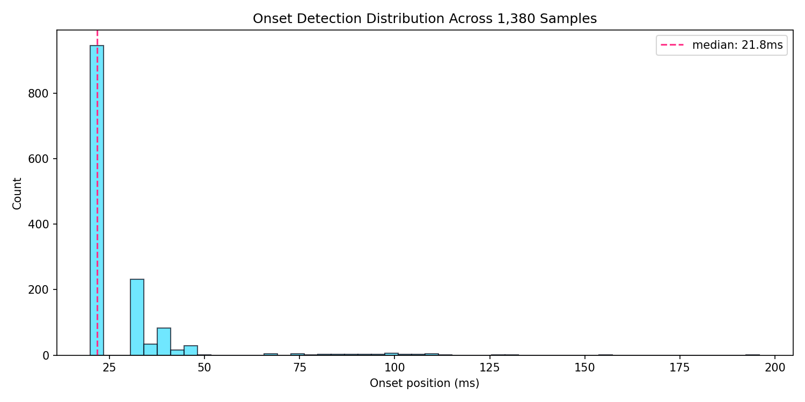
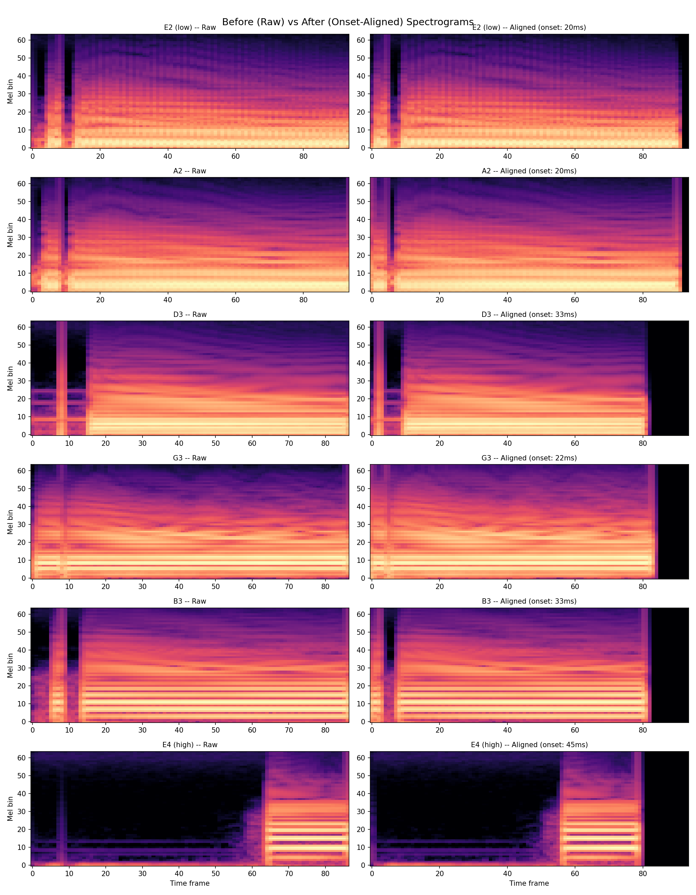
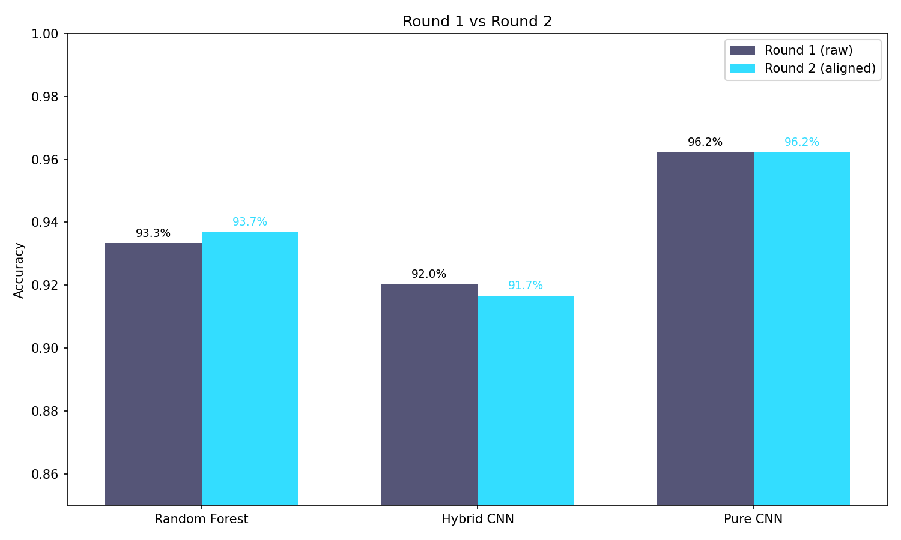

# Round 2: Onset-Aligned Training Results

## Change from Round 1
- **What changed:** Added onset detection to align all samples to the pluck attack
- **Why:** Raw samples had variable silence before the pluck, wasting spectrogram resolution
- **Onset stats:** median=21.8ms, mean=27.7ms, max=195.9ms

## Results Comparison

| Model | Round 1 | Round 2 | Delta |
|-------|---------|---------|-------|
| Random Forest | 93.3% | **93.7%** | +0.4% |
| Hybrid CNN | 92.0% | **91.7%** | -0.4% |
| Pure CNN | 96.2% | **96.2%** | +0.0% |

## Per-String (Pure CNN)

| String | Round 1 | Round 2 | Delta |
|--------|---------|---------|-------|
| E2 (low) | 94.3% | 93.9% | -0.4% |
| A2 | 93.5% | 94.3% | +0.9% |
| D3 | 97.4% | 97.0% | -0.4% |
| G3 | 98.3% | 97.8% | -0.4% |
| B3 | 96.5% | 96.5% | +0.0% |
| E4 (high) | 97.4% | 97.8% | +0.4% |

*Generated: 2026-04-01 01:41*