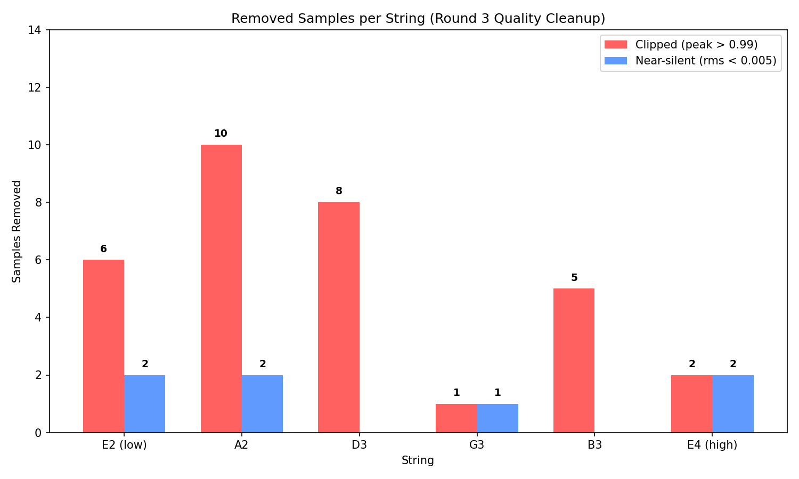
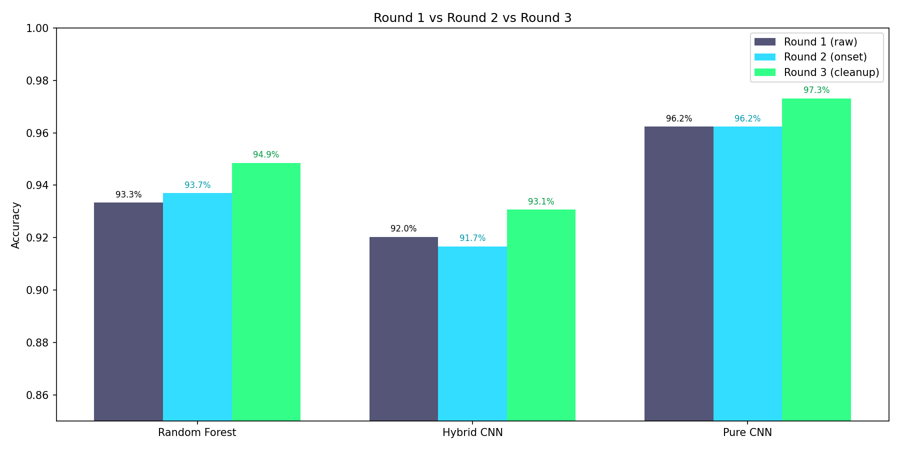

# Round 3: Quality Cleanup Results

## What Changed
- **Removed 32 clipped samples** (peak > 0.99) -- distorted audio that confuses classifiers
- **Removed 7 near-silent samples** (rms < 0.005) -- too quiet to contain useful signal
- Dataset size: 1380 -> 1341 samples (39 removed, 2.8%)

### Removed Samples by String

| String | Clipped | Silent | Total Removed |
|--------|---------|--------|---------------|
| E2 (low) | 6 | 2 | 8 |
| A2 | 10 | 2 | 12 |
| D3 | 8 | 0 | 8 |
| G3 | 1 | 1 | 2 |
| B3 | 5 | 0 | 5 |
| E4 (high) | 2 | 2 | 4 |
| **TOTAL** | **32** | **7** | **39** |

## Results Comparison

| Model | Round 1 (raw) | Round 2 (onset) | Round 3 (cleanup) | Delta (R3-R1) |
|-------|---------------|-----------------|-------------------|---------------|
| Random Forest | 93.3% | 93.7% | **94.9%** | +1.5% |
| Hybrid CNN | 92.0% | 91.7% | **93.1%** | +1.0% |
| Pure CNN | 96.2% | 96.2% | **97.3%** | +1.1% |

## Per-String Accuracy (Pure CNN)

| String | Round 1 | Round 2 | Round 3 | Delta (R3-R1) |
|--------|---------|---------|---------|---------------|
| E2 (low) | 94.3% | 93.9% | 96.0% | +1.6% |
| A2 | 93.5% | 94.3% | 95.4% | +1.9% |
| D3 | 97.4% | 97.0% | 97.7% | +0.3% |
| G3 | 98.3% | 97.8% | 98.7% | +0.4% |
| B3 | 96.5% | 96.5% | 97.3% | +0.8% |
| E4 (high) | 97.4% | 97.8% | 98.7% | +1.3% |

*Generated: 2026-04-01 03:51*