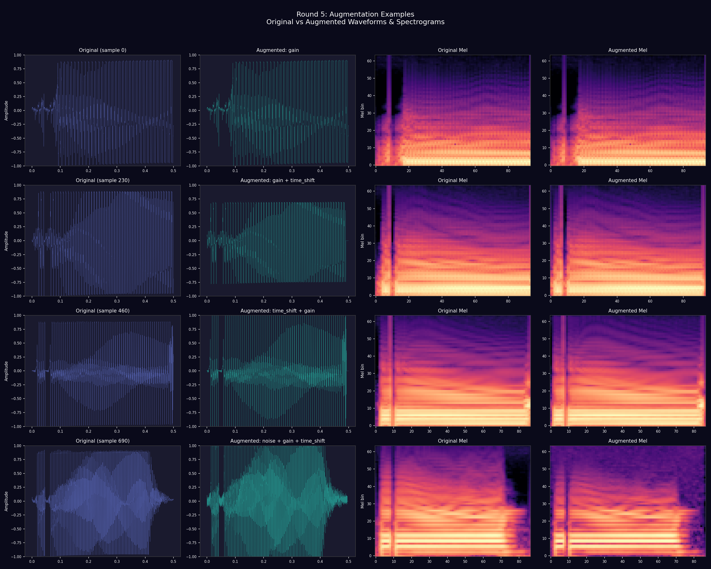
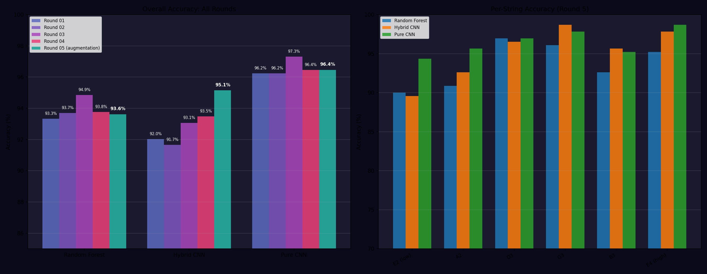

# Round 5: Data Augmentation

## Hypothesis

With only ~10 samples per class, the models (especially CNNs) are prone
to overfitting. Data augmentation creates modified copies of training
samples that preserve the guitar string+fret label while increasing
diversity. This should improve generalization without needing to capture
more real data.

## Augmentations Applied

### Safe augmentations (label-preserving):

| Augmentation | Description | Parameters |
|-------------|-------------|------------|
| Gain variation | Scale amplitude by random factor | [0.7, 1.3] |
| Noise injection | Add Gaussian noise (5% of signal RMS) | noise_level = rms * 0.05 |
| Time shift | Shift onset by +/-10ms | +/-480 samples @ 48kHz |
| Time stretch | Pitch-invariant stretch/compress | [0.95, 1.05] rate |

### Deliberately excluded (DANGEROUS for this task):

- **Pitch shifting** -- even 0.5 semitone makes one fret sound like another
- **Large time stretch** -- changes harmonic content too much
- **SpecAugment freq masking** -- can mask exact harmonics that distinguish strings

### Augmentation distribution:

| Type | Count |
|------|-------|
| gain | 2074 |
| noise | 2092 |
| time_shift | 2015 |
| time_stretch | 2167 |

Each augmented sample receives 1-2 randomly chosen augmentations.

## Dataset

| Metric | Value |
|--------|-------|
| Original samples | 1380 |
| Augmented copies per sample | 3 |
| Total augmented | 4140 |
| Total training pool | 5520 |
| Classes | 138 |
| Effective samples per class | ~40 |

## Evaluation

- **Method:** 5-fold stratified CV (stratified on ORIGINAL samples)
- **Leakage prevention:** augmented copies always in same fold as original
- **Validation:** ONLY original (unaugmented) samples -- never evaluate on augmented data
- **Models:** same architectures as Round 1 (RF, Hybrid CNN, Pure CNN)

## Results

| Model | Round 01 | Round 02 | Round 03 | Round 04 | Round 05 | Delta (R5-R1) |
|-------|---------|---------|---------|---------|---------|---------------|
| Random Forest | 93.3% | 93.7% | 94.9% | 93.8% | **93.6%** | +0.3% |
| Hybrid CNN | 92.0% | 91.7% | 93.1% | 93.5% | **95.1%** | +3.1% |
| Pure CNN | 96.2% | 96.2% | 97.3% | 96.4% | **96.4%** | +0.2% |

## Per-String Accuracy

| String | Random Forest R5 | Hybrid CNN R5 | Pure CNN R5 | Random Forest R1 | Hybrid CNN R1 | Pure CNN R1 |
|--------|---------|---------|---------|---------|---------|---------|
| E2 (low) | 90.0% | 89.6% | 94.3% | 86.1% | 81.3% | 94.3% |
| A2 | 90.9% | 92.6% | 95.7% | 91.3% | 88.3% | 93.5% |
| D3 | 97.0% | 96.5% | 97.0% | 97.0% | 93.9% | 97.4% |
| G3 | 96.1% | 98.7% | 97.8% | 95.7% | 96.1% | 98.3% |
| B3 | 92.6% | 95.7% | 95.2% | 93.5% | 96.1% | 96.5% |
| E4 (high) | 95.2% | 97.8% | 98.7% | 96.5% | 96.5% | 97.4% |

## Key Findings

- **Random Forest**: improved by 0.3% (93.3% -> 93.6%)
  - E2 (low) string: +3.9% (86.1% -> 90.0%)
- **Hybrid CNN**: improved by 3.1% (92.0% -> 95.1%)
  - E2 (low) string: +8.3% (81.3% -> 89.6%)
- **Pure CNN**: improved by 0.2% (96.2% -> 96.4%)
  - E2 (low) string: +0.0% (94.3% -> 94.3%)

## Visualizations

- `augmentation_examples.png` -- original vs augmented waveforms & spectrograms
- `round_05_comparison.png` -- accuracy comparison across all rounds
- `training_curves_*.png` -- CNN training loss and validation accuracy

*Generated: 2026-04-01 05:31*
