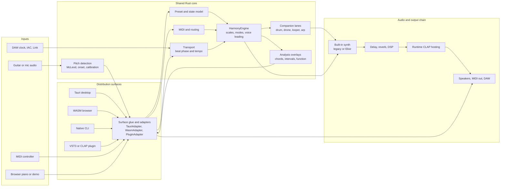
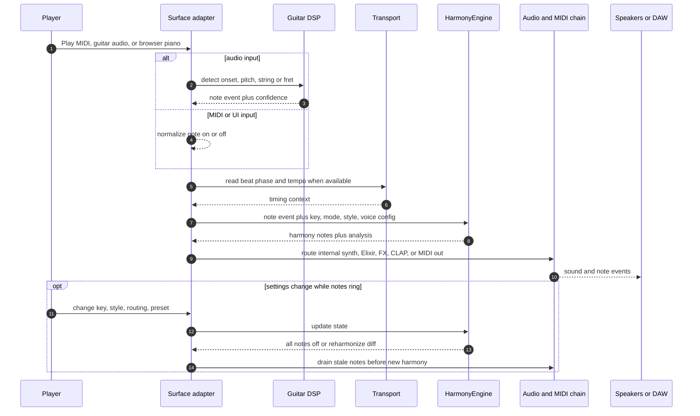
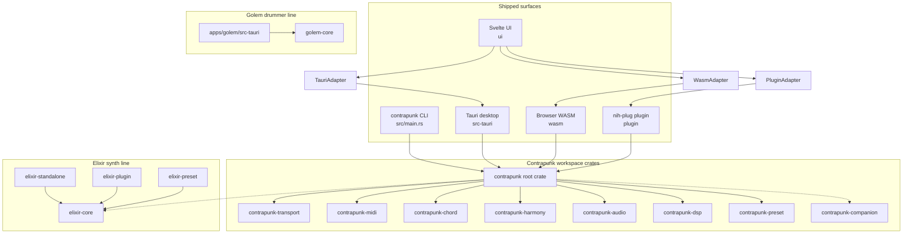
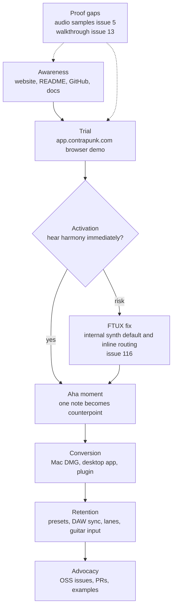

# Contrapunk Diagram Snippets

> Compact Mermaid snippets synthesized from `README.md`, `recon/github-issues.md`, `recon/planning-roadmap.md`, `Cargo.toml`, and `graphify-out/GRAPH_REPORT.md`. Roadmap order is inferred where the sources only expose backlog signals.

## Architecture

## Event Flow

## Crate and Surface Map

## Roadmap

```mermaid
flowchart LR
    Done["Baseline shipped<br/>desktop, browser, plugin path<br/>v1.1 web demo readiness mostly closed"]
    Backlog["Open backlog<br/>41 issues<br/>companion, integrations, guitar, theory lead"]
    Triage["Trim stale work<br/>close or rescope superseded items"]
    Ftux["Activation fix<br/>default sound path and visible routing<br/>issue 116"]
    ElixirNow["Current focus<br/>Elixir v1.5 / elixir-v0.1.0"]
    B5["Next named slice<br/>plugin preset serialization and load"]
    B7["B7 wavetable parity"]
    Release["B8/B9 render and public Elixir release"]
    CompanionMvp["Companion MVP<br/>DrumLane, DroneLane, LooperLane, ArpLane"]
    GuitarRewrite["Guitar rewrite<br/>fixtures, A/B stages, native/WASM parity"]
    DawBase["DAW foundation<br/>sync, IAC, BlackHole, openDAW"]
    Intelligence["Sampler and audio intelligence<br/>ListenLane, sidechain, slicing"]
    Theory["Theory depth<br/>historical rules and live analysis"]
    Deferred["Known pending<br/>modal UX review, note generator WASM parity,<br/>logo icons, DMG polish"]

    Done --> Backlog --> Triage --> Ftux
    Ftux --> ElixirNow --> B5 --> B7 --> Release
    Ftux --> CompanionMvp --> GuitarRewrite --> DawBase --> Intelligence --> Theory
    Done -.-> Deferred
    Deferred -.-> Triage
```

## Marketing Funnel

